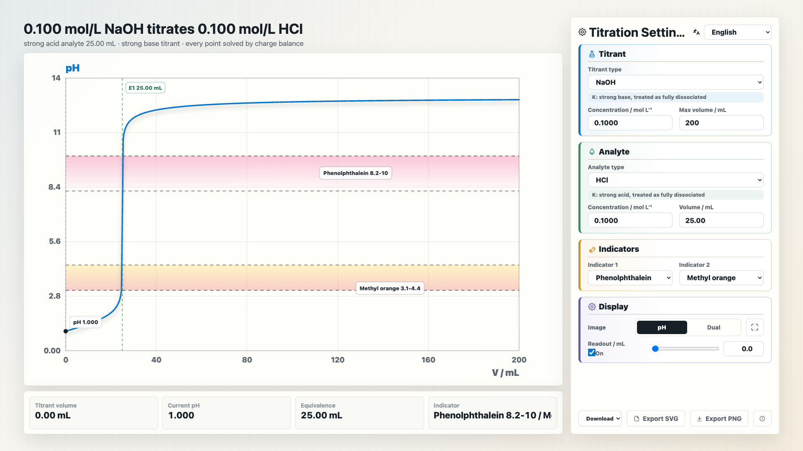

# Acid-Base Titration Curve Generator

Interactive acid-base titration curve generator for chemistry teaching, classroom demonstration, and self-study.

> Version 1.0 · Updated on 2026-07-02  
> Created by Daniel@猫猫化学团队, Codex, and ChatGPT



## Open The Tool

```text
https://danielll-c.github.io/Acid-Base-Titration/
```

## Language

[简体中文](#简体中文) · [繁體中文](#繁體中文) · [English](#english) · [日本語](#日本語)

---

## 简体中文

### 这是什么？

这是一个面向化学学习与课堂展示的酸碱中和滴定曲线生成器。你可以选择标准溶液和待测液，输入浓度与体积，页面会自动生成对应的 pH-V 滴定曲线。

它适合用于：

- 化学课堂演示
- 酸碱滴定复习
- 指示剂选择讲解
- 强酸强碱、弱酸强碱、弱碱强酸等体系对比
- 碳酸盐等双终点滴定曲线展示

### 怎么使用？

1. 打开在线页面。
2. 在右侧选择“标准溶液”和“待测液”。
3. 输入浓度、体积等参数。
4. 选择需要显示的指示剂，最多可同时显示两种。
5. 使用“pH / 双曲线”切换图像显示方式。
6. 打开读数模块后，可以拖动滑块或手动输入体积，查看对应 pH。
7. 需要保存图像时，可以导出 SVG 或 PNG。

### 可以观察什么？

- 滴定开始时 pH 的变化
- 等当点位置
- pH 突跃区间
- 指示剂变色范围是否覆盖突跃区间
- 一阶导曲线峰值与等当点的关系
- 多元酸碱或盐类体系中的多个终点

### 支持内容

工具内置了常见强酸、强碱、弱酸、弱碱和盐，也支持自定义溶液名称与 K 值。

内置指示剂包括酚酞、甲基橙、甲基红、溴百里酚蓝、溴甲酚绿、石蕊、酚红、溴酚蓝等常见指示剂。

### 注意事项

本工具用于教学展示和学习理解。数据和模型尽量依据分析化学原理处理，但不用于正式实验数据处理或科研级精密计算。

---

## 繁體中文

### 這是什麼？

這是一個面向化學學習與課堂展示的酸鹼中和滴定曲線產生器。你可以選擇標準溶液和待測液，輸入濃度與體積，頁面會自動產生對應的 pH-V 滴定曲線。

它適合用於：

- 化學課堂展示
- 酸鹼滴定複習
- 指示劑選擇講解
- 強酸強鹼、弱酸強鹼、弱鹼強酸等體系對比
- 碳酸鹽等雙終點滴定曲線展示

### 如何使用？

1. 打開線上頁面。
2. 在右側選擇「標準溶液」和「待測液」。
3. 輸入濃度、體積等參數。
4. 選擇需要顯示的指示劑，最多可同時顯示兩種。
5. 使用「pH / 雙曲線」切換圖像顯示方式。
6. 打開讀數模組後，可以拖動滑桿或手動輸入體積，查看對應 pH。
7. 需要保存圖像時，可以匯出 SVG 或 PNG。

### 可以觀察什麼？

- 滴定開始時 pH 的變化
- 等當點位置
- pH 突躍區間
- 指示劑變色範圍是否覆蓋突躍區間
- 一階導曲線峰值與等當點的關係
- 多元酸鹼或鹽類體系中的多個終點

### 支援內容

工具內建常見強酸、強鹼、弱酸、弱鹼和鹽，也支援自訂溶液名稱與 K 值。

內建指示劑包括酚酞、甲基橙、甲基紅、溴百里酚藍、溴甲酚綠、石蕊、酚紅、溴酚藍等常見指示劑。

### 注意事項

本工具用於教學展示和學習理解。資料和模型盡量依據分析化學原理處理，但不適用於正式實驗資料處理或研究級精密計算。

---

## English

### What Is This?

This is an interactive acid-base titration curve generator for chemistry learning and classroom demonstration. Choose a titrant and an analyte, enter concentration and volume, and the page will generate the corresponding pH-V titration curve.

It is designed for:

- chemistry classroom demonstrations
- acid-base titration review
- explaining indicator selection
- comparing strong acid/base and weak acid/base systems
- visualizing double-endpoint titrations such as carbonate systems

### How To Use

1. Open the online page.
2. Select the titrant and analyte on the right panel.
3. Enter concentration, volume, and other parameters.
4. Choose one or two indicators, or hide them.
5. Switch between pH curve and dual-curve view.
6. Enable the readout module to inspect pH at a chosen titrant volume.
7. Export the graph as SVG or PNG when needed.

### What You Can Observe

- initial pH and pH change during titration
- equivalence point position
- steep pH transition region
- whether an indicator range fits the transition region
- relationship between the derivative peak and equivalence point
- multiple endpoints in polyprotic or salt systems

### Supported Content

The tool includes common strong acids, strong bases, weak acids, weak bases, and salts. It also supports custom reagents with manually entered names and K values.

Common indicators such as phenolphthalein, methyl orange, methyl red, bromothymol blue, bromocresol green, litmus, phenol red, and bromophenol blue are included.

### Note

This tool is intended for teaching and conceptual visualization. The data and model follow analytical chemistry principles, but the tool is not intended for formal laboratory data processing or research-grade calculation.

---

## 日本語

### これは何ですか？

これは化学学習と授業展示向けの酸塩基滴定曲線ジェネレーターです。標準溶液と試料溶液を選び、濃度と体積を入力すると、対応する pH-V 滴定曲線が表示されます。

主な用途：

- 化学授業での演示
- 酸塩基滴定の復習
- 指示薬選択の説明
- 強酸・強塩基、弱酸・強塩基、弱塩基・強酸などの比較
- 炭酸塩などの二段階終点滴定の可視化

### 使い方

1. オンラインページを開きます。
2. 右側の設定欄で標準溶液と試料溶液を選びます。
3. 濃度、体積などのパラメータを入力します。
4. 表示する指示薬を選びます。最大 2 種類まで同時表示できます。
5. pH 曲線表示と双曲線表示を切り替えます。
6. 読み取り機能を使うと、指定した滴定体積での pH を確認できます。
7. 必要に応じて SVG または PNG として書き出せます。

### 観察できること

- 滴定開始時の pH
- 当量点の位置
- pH の急変領域
- 指示薬の変色範囲と急変領域の対応
- 一階導関数のピークと当量点の関係
- 多価酸塩基や塩の複数終点

### 対応内容

一般的な強酸、強塩基、弱酸、弱塩基、塩に対応しています。名称と K 値を入力してカスタム溶液を作成することもできます。

フェノールフタレイン、メチルオレンジ、メチルレッド、ブロモチモールブルー、ブロモクレゾールグリーン、リトマス、フェノールレッドなどの指示薬を利用できます。

### 注意

このツールは教育用の可視化ツールです。分析化学の原理に基づいていますが、正式な実験データ処理や研究用の精密計算を目的としたものではありません。

---

## Data Sources / 数据来源

The acid-base constants and indicator ranges are based on common analytical chemistry references, including CRC Handbook of Chemistry and Physics, Lange's Handbook of Chemistry, NIST Chemistry WebBook, general analytical chemistry textbooks, and standard acid-base indicator tables.

Structured data snapshot:

```text
database/acid-base-titration-database.json
```

## License And Use / 使用说明

This project may be used, copied, modified, and shared for chemistry teaching, classroom demonstration, and non-commercial educational use.

Please keep the maker attribution and data source notes when redistributing or adapting this project.

